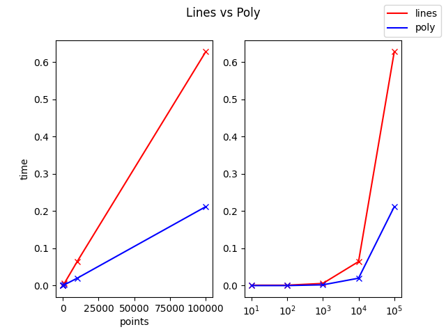

Canvas: Poly vs Line
==============

This script creates a quick comparisson demonstrating the runtime difference
when drawing the shortest path with a polygon compared to a line.

Example:
--------

Following performance test was run on an Intel i9-10850K and resulted in the graph below:

