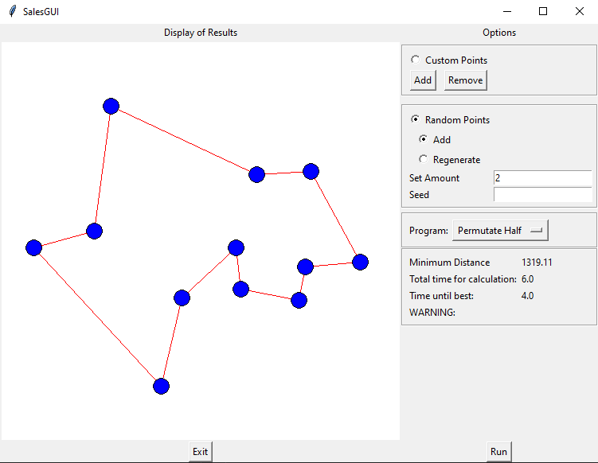

GUI Builder
===========

Python class providing the GUI class. Can be either imported for separate use or run as script.

SalesGUI
--------
Class for handling the GUI

.. autoclass:: Salesman.python.gui_builder.SalesGUI
    :members:

    .. automethod:: __init__

Example
-------

The GUI can be directly run from the console with following command:

.. code-block:: bash

    python -m gui_builder

Following window will be displayed:

The path calculation can be started by clicking *run*.
Two options exist concerning the points:
 - use existing points, adding or removing custom points
 - generate new points

.. warning::
    Select the calculation program with care,
    as permution based calculations require significantly more runtime!